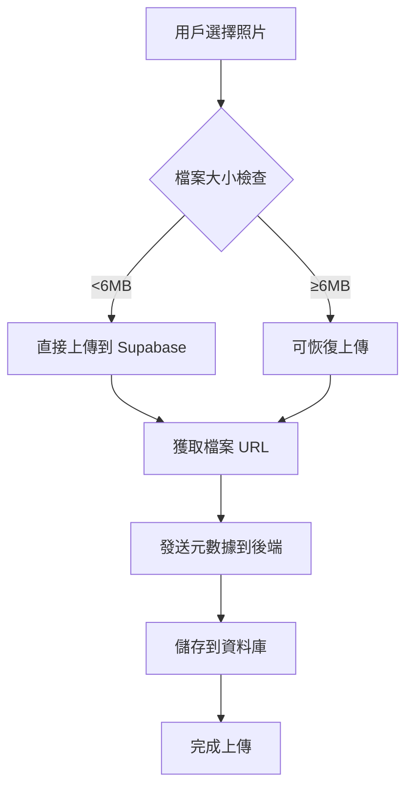

# 客戶端直接上傳功能使用指南

## 概述

本系統已升級為客戶端直接上傳到 Supabase Storage，移除了原有的 5MB 檔案大小限制。現在用戶可以上傳任意大小的照片，系統會自動選擇最適合的上傳方式。

## 功能特點

### 🚀 無檔案大小限制
- 移除了原有的 5MB 檔案大小限制
- 支援上傳高解析度照片和大型圖片檔案
- 用戶可以分享更清晰、更詳細的回憶

### 🔄 智能上傳方式
- **小檔案 (<6MB)**：使用直接上傳，快速高效
- **大檔案 (≥6MB)**：自動使用可恢復上傳 (Resumable Upload)，提高網路不穩定時的成功率

### 📊 實時進度顯示
- 顯示詳細的上傳進度百分比
- 提供上傳狀態說明（準備、上傳、處理、完成）
- 支援取消上傳操作

### 🛡️ 安全性保障
- 使用 Supabase RLS (Row Level Security) 政策
- 用戶認證驗證
- 檔案來源驗證

## 使用方法

### 一般用戶上傳

1. **訪問照片上傳頁面** (`/photo-upload`)
2. **選擇照片**：
   - 點擊上傳區域選擇檔案
   - 支援拖拽上傳
   - 可同時選擇多張照片
3. **填寫祝福語**：
   - 為照片留下美好的祝福
   - 多張照片會自動添加序號
4. **選擇隱私設定**：
   - 公開展示：所有賓客可見並投票
   - 私下傳送：只有新人可見
5. **開始上傳**：
   - 點擊「上傳照片」按鈕
   - 系統會自動選擇最佳上傳方式
   - 等待上傳完成

### 管理員上傳

管理員後台 (`/admin/photos`) 仍然使用傳統的上傳方式，但已移除檔案大小限制。

## 技術細節

### 上傳流程



### 檔案命名規則

上傳的檔案會按照以下格式命名：
```
{用戶ID}_{時間戳}_{隨機字串}.{副檔名}
```

例如：`U1234567890_1704067200000_abc123.jpg`

### 支援的檔案格式

- JPEG (.jpg, .jpeg)
- PNG (.png)
- GIF (.gif)
- WebP (.webp)

## 測試功能

系統提供了專門的測試頁面 (`/debug/direct-upload-test`)：

### 測試功能
- 測試各種大小的檔案上傳
- 比較不同上傳方式的性能
- 驗證錯誤處理機制
- 查看詳細的上傳統計

### 使用方法
1. 確保已登入系統
2. 訪問 `/debug/direct-upload-test`
3. 選擇要測試的圖片檔案
4. 點擊「開始測試」
5. 查看測試結果和性能數據

## 常見問題

### Q: 上傳大檔案時網路中斷怎麼辦？
A: 對於 6MB 以上的檔案，系統會自動使用可恢復上傳技術。如果網路中斷，重新上傳同一檔案時會從中斷點繼續。

### Q: 上傳速度會受到影響嗎？
A: 直接上傳通常比傳統的代理上傳更快，因為減少了中間層。大檔案的可恢復上傳可能會稍微慢一些，但可靠性更高。

### Q: 如何知道使用了哪種上傳方式？
A: 在上傳過程中，系統會顯示使用的上傳方式。測試頁面也會詳細顯示每個檔案使用的上傳方法。

### Q: 上傳的檔案有安全風險嗎？
A: 系統使用多層安全保護：
- 用戶認證驗證
- Supabase RLS 政策控制存取
- 檔案類型驗證
- 檔案來源驗證

## 效能建議

### 最佳實踐
1. **網路環境**：建議在穩定的網路環境下上傳大檔案
2. **檔案準備**：上傳前可以適當壓縮圖片以節省時間
3. **批次上傳**：多張小檔案可以同時上傳，提高效率
4. **錯誤處理**：如遇上傳失敗，檢查網路連接後重試

### 效能參考
- 小檔案 (<1MB)：通常 1-3 秒
- 中等檔案 (1-6MB)：通常 3-10 秒
- 大檔案 (>6MB)：根據網路狀況，可能需要 10 秒以上

## 故障排除

### 常見錯誤及解決方案

1. **「請選擇圖片檔案」**
   - 確保選擇的是支援的圖片格式
   - 檢查檔案是否損壞

2. **「上傳失敗」**
   - 檢查網路連接
   - 確認 Supabase 服務狀態
   - 嘗試重新上傳

3. **「用戶身份驗證失敗」**
   - 確保已正確登入
   - 重新整理頁面後重試

4. **「照片資訊儲存失敗」**
   - 通常是暫時性問題
   - 稍後重試即可

## 技術支援

如果遇到技術問題，請：

1. **查看控制台錯誤訊息**
2. **使用測試頁面驗證功能**
3. **聯繫技術支援團隊**

---

*本功能遵循 OpenSpec 規範開發，確保程式碼品質和可維護性。*