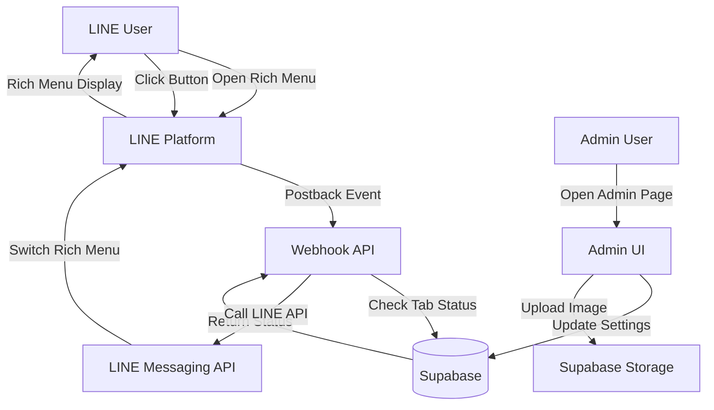

# Design: LINE Rich Menu Tabs

## Context

婚禮互動遊戲系統目前使用單一 LINE Rich Menu，包含 6 個功能按鈕。為了更好地組織功能並提升用戶體驗，需要實作一個具備兩個可切換分頁的 Rich Menu 系統。

### Constraints
- LINE Rich Menu API 限制：每個 Rich Menu 有固定尺寸（2500x1686px）
- LINE Rich Menu API 限制：每個 Rich Menu 最多 20 個按鈕區域
- 需要與現有 LINE Login 和 LIFF 整合
- 需要支援分頁啟用/停用狀態
- 停用分頁時顯示「未開放」圖片

### Stakeholders
- 賓客：透過 LINE Bot 使用 Rich Menu 訪問各種功能
- 管理員：透過後台介面管理 Rich Menu 設定
- 新人：能夠根據婚禮流程控制功能開放時機

## Goals / Non-Goals

### Goals
- 建立兩個可切換的 LINE Rich Menu 分頁（會場資訊、現場活動）
- 提供後台管理介面控制分頁啟用狀態和預設分頁
- 停用分頁時顯示「未開放」圖片，按鈕無法點擊
- 每個分頁包含 4 個功能按鈕
- 支援用戶在分頁之間切換

### Non-Goals
- 不支援動態調整按鈕位置
- 不支援自定義 Rich Menu 圖片（使用預設模板）
- 不支援用戶個人化 Rich Menu 設定
- 不支援多語言 Rich Menu

## Decisions

### Decision 1: 使用 LINE 原生多個 Rich Menu 實作分頁

**What**: 創建 3 個 LINE Rich Menu（會場資訊、現場活動、未開放），透過 API 為用戶設置不同的預設 Rich Menu。

**Why**:
- LINE 原生支援多個 Rich Menu，切換速度快
- 用戶體驗流暢，無需額外網頁跳轉
- 符合 LINE 設計規範

**Alternatives considered**:
- 單一 Rich Menu + 網頁選單：需要額外網頁跳轉，用戶體驗較差

### Decision 2: 資料庫儲存 Rich Menu 設定和用戶分頁狀態

**What**: 使用 Supabase 儲存 Rich Menu 設定和每個用戶的當前分頁狀態。

**Why**:
- 集中管理設定，方便後台介面操作
- 支援用戶個人化分頁狀態
- 與現有系統架構一致

**Alternatives considered**:
- 儲存在環境變數：不支援動態調整
- 儲存在 LINE Platform：無法與後台介面整合

### Decision 3: 停用分頁使用專用「未開放」Rich Menu

**What**: 當分頁停用時，將用戶切換到專用的「未開放」Rich Menu，顯示提示圖片。

**Why**:
- 清晰傳達功能未開放的訊息
- 避免用戶困惑
- 符合使用者預期

**Alternatives considered**:
- 隱藏分頁：用戶不知道功能存在
- 顯示停用分頁但按鈕無法點擊：需要修改按鈕 action，實作複雜

### Decision 4: 使用 Postback 事件處理分頁切換

**What**: Rich Menu 中的「進入遊戲分頁」和「進入會場資訊分頁」按鈕使用 postback action，觸發 webhook 進行分頁切換。

**Why**:
- Postback 事件可以直接傳遞數據（分頁類型）
- 無需額外網頁跳轉
- 符合 LINE 最佳實踐

**Alternatives considered**:
- URI action：需要創建中間頁面處理切換
- Message action：用戶需要發送訊息，體驗較差

## Architecture

### System Architecture



### Database Schema

```sql
-- Rich Menu 全域設定
CREATE TABLE line_richmenu_settings (
    id SERIAL PRIMARY KEY,
    default_tab VARCHAR(50) NOT NULL DEFAULT 'venue_info', -- venue_info | activity
    venue_tab_enabled BOOLEAN NOT NULL DEFAULT TRUE,
    activity_tab_enabled BOOLEAN NOT NULL DEFAULT TRUE,
    updated_at TIMESTAMP WITH TIME ZONE DEFAULT NOW()
);

-- 用戶 Rich Menu 狀態
CREATE TABLE line_richmenu_user_states (
    line_id VARCHAR(255) PRIMARY KEY REFERENCES users(line_id),
    current_tab VARCHAR(50) NOT NULL DEFAULT 'venue_info',
    updated_at TIMESTAMP WITH TIME ZONE DEFAULT NOW()
);

-- Rich Menu 設定記錄（追蹤 LINE Platform 上的 Rich Menu ID）
CREATE TABLE line_richmenu_registry (
    id SERIAL PRIMARY KEY,
    menu_type VARCHAR(50) NOT NULL UNIQUE, -- venue_info | activity | unavailable
    richmenu_id VARCHAR(255) NOT NULL,
    created_at TIMESTAMP WITH TIME ZONE DEFAULT NOW(),
    updated_at TIMESTAMP WITH TIME ZONE DEFAULT NOW()
);
```

### Rich Menu Configuration

**會場資訊分頁 (venue_info)**
- 尺寸：2500x1686px
- 按鈕配置（2x2）：
  1. 交通資訊 (0,0, 1250, 843) → LIFF: `/venue-info/transport`
  2. 菜單 (1250,0, 1250, 843) → LIFF: `/venue-info/menu`
  3. 桌次 (0,843, 1250, 843) → LIFF: `/venue-info/table`
  4. 進入遊戲分頁 (1250,843, 1250, 843) → Postback: `switch_tab:activity`

**現場活動分頁 (activity)**
- 尺寸：2500x1686px
- 按鈕配置（2x2）：
  1. 照片上傳 (0,0, 1250, 843) → LIFF: `/photo-upload`
  2. 祝福照片牆 (1250,0, 1250, 843) → LIFF: `/photo-wall`
  3. 快問快答 (0,843, 1250, 843) → LIFF: `/quiz`
  4. 進入會場資訊分頁 (1250,843, 1250, 843) → Postback: `switch_tab:venue_info`

**未開放分頁 (unavailable)**
- 尺寸：2500x1686px
- 按鈕配置：無按鈕（顯示「目前尚未開放」圖片）

## API Design

### GET /api/admin/richmenu/settings
獲取 Rich Menu 設定

**Response**:
```json
{
  "defaultTab": "venue_info",
  "venueTabEnabled": true,
  "activityTabEnabled": true,
  "richMenuIds": {
    "venue_info": "richmenu-xxx",
    "activity": "richmenu-yyy",
    "unavailable": "richmenu-zzz"
  }
}
```

### POST /api/admin/richmenu/settings
更新 Rich Menu 設定

**Request**:
```json
{
  "defaultTab": "venue_info",
  "venueTabEnabled": true,
  "activityTabEnabled": false
}
```

### POST /api/line/richmenu/switch
處理用戶分頁切換請求（由 webhook 調用）

**Request**:
```json
{
  "lineId": "U1234567890",
  "targetTab": "activity"
}
```

**Response**:
```json
{
  "success": true,
  "message": "Rich menu switched to activity tab"
}
```

## Risks / Trade-offs

### Risk 1: LINE API 速率限制
**Risk**: 頻繁調用 LINE API 可能觸發速率限制

**Mitigation**:
- 快取 Rich Menu ID
- 批次處理用戶分頁切換
- 監控 API 調用頻率

### Risk 2: Rich Menu 圖片上傳失敗
**Risk**: 上傳 Rich Menu 圖片到 LINE Platform 可能失敗

**Mitigation**:
- 提供重試機制
- 顯示詳細錯誤訊息
- 提供手動上傳備選方案

### Trade-off 1: 分頁切換需要 API 調用
**Trade-off**: 每次用戶切換分頁都需要調用 LINE API，可能造成延遲

**Justification**: 這是 LINE API 的限制，無法避免。延遲通常在 1-2 秒內，用戶體驗可接受。

### Trade-off 2: 需要維護 3 個 Rich Menu
**Trade-off**: 系統需要維護 3 個 Rich Menu（會場資訊、現場活動、未開放），增加複雜度

**Justification**: 這是實作分頁功能的必要代價，帶來的用戶體驗提升值得這個複雜度。

## Migration Plan

### Phase 1: 資料庫設定
1. 執行 migration script 建立新表
2. 插入預設設定

### Phase 2: API 開發
1. 實作 Rich Menu 設定 API
2. 實作分頁切換 API
3. 實作圖片上傳 API

### Phase 3: 後台介面
1. 建立 Rich Menu 管理頁面
2. 整合設定 API

### Phase 4: LINE Platform 整合
1. 創建 3 個 Rich Menu
2. 上傳 Rich Menu 圖片
3. 設置預設 Rich Menu

### Phase 5: 前端頁面
1. 建立會場資訊頁面
2. 整合 LIFF 連結

### Rollback
- 刪除新建立的表
- 刪除 LINE Platform 上的 Rich Menu
- 恢復舊的 webhook 處理邏輯

## Open Questions

1. **Rich Menu 圖片設計**: 是否需要專業設計師製作 Rich Menu 圖片，還是使用簡單的文字圖片？

2. **分頁切換通知**: 用戶切換分頁時是否需要顯示通知訊息？

3. **未開放分頁文字**: 「未開放」分頁顯示的具體文字內容是什麼？
