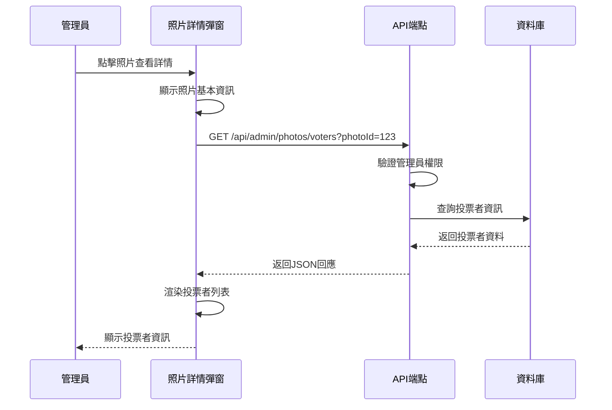
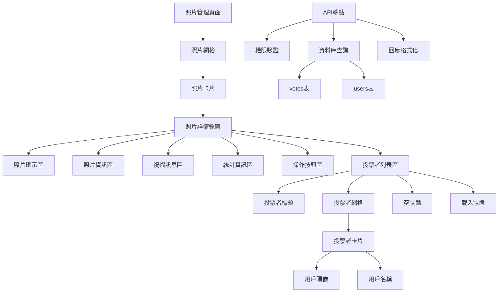
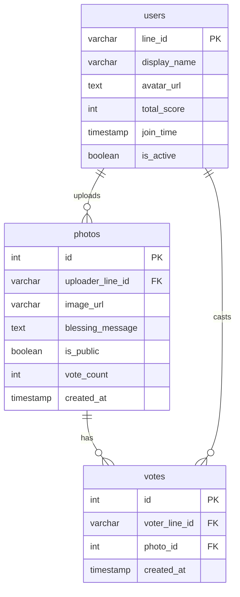
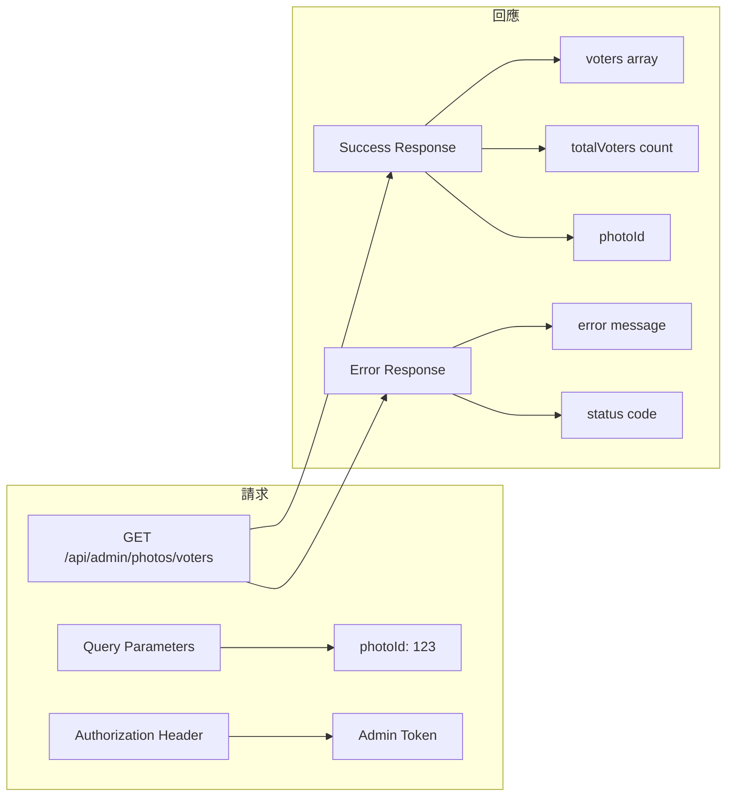
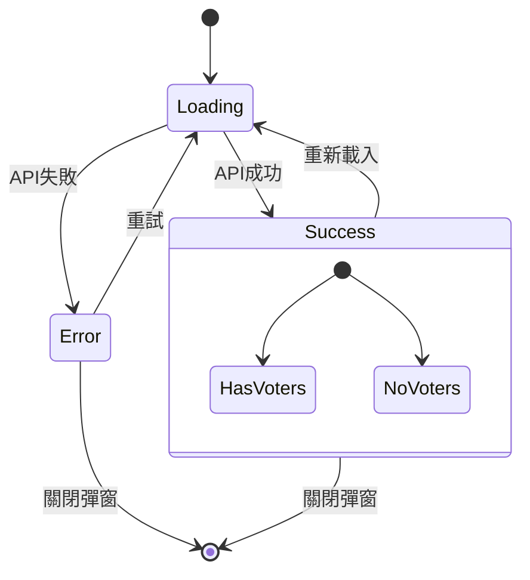
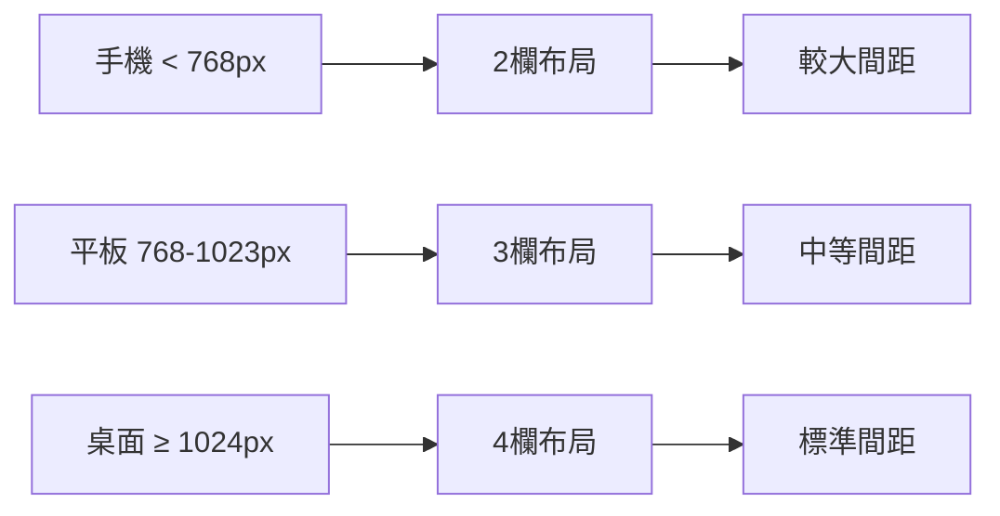
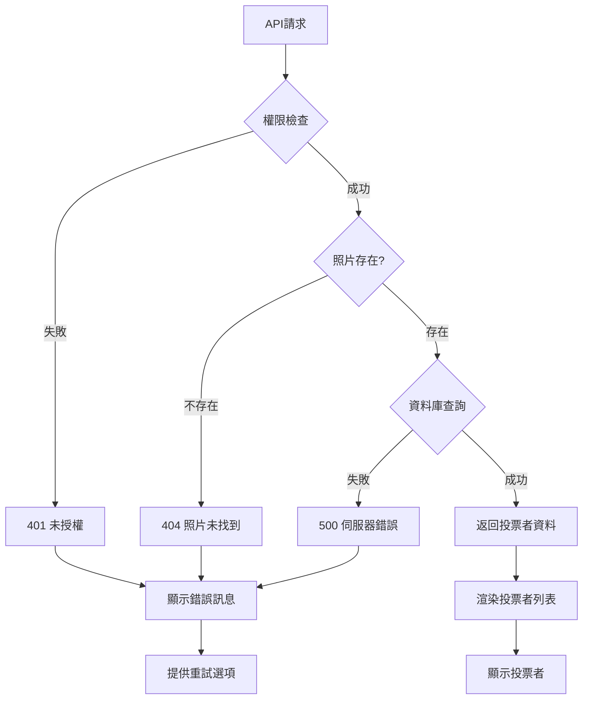

# 系統架構圖

## 資料流程圖



## 組件架構圖



## 資料庫關係圖



## API 請求/回應結構



## 前端狀態管理



## 響應式設計斷點



## 錯誤處理流程



## 效能優化策略

```mermaid
graph TD
    A[資料庫查詢] --> B[使用索引]
    B --> C[只選擇必要欄位]
    C --> D[限制結果數量]
    
    E[前端渲染] --> F[懶載入圖片]
    F --> G[骨架屏載入]
    G --> H[虛擬化長列表]
    
    I[快取策略] --> J[API回應快取]
    J --> K[圖片快取]
    K --> L[瀏覽器快取]