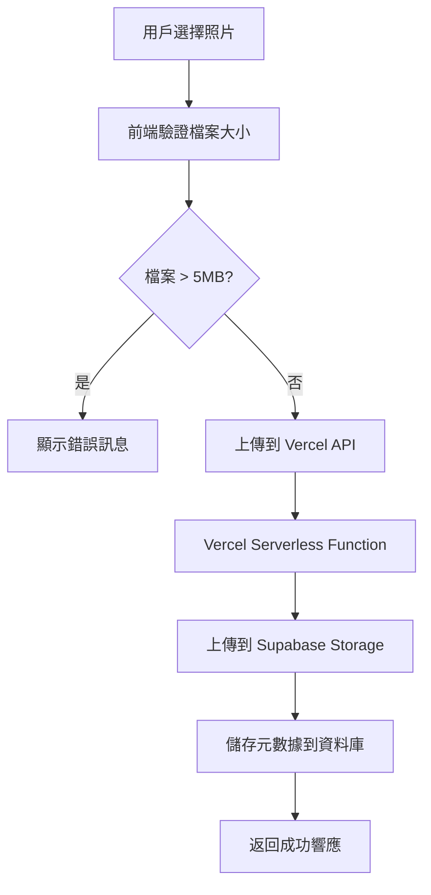
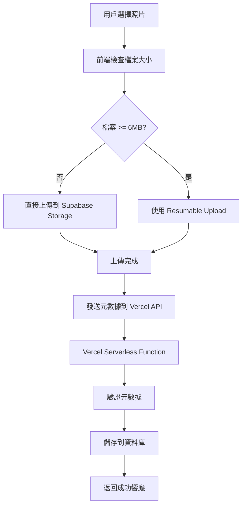
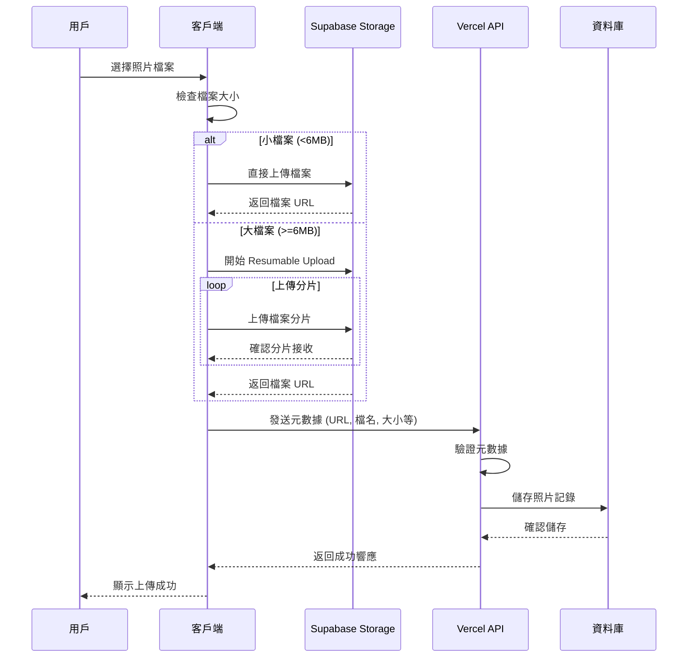
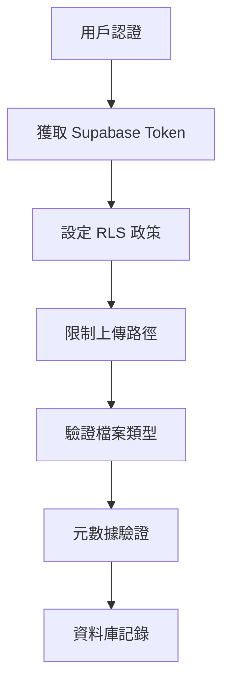
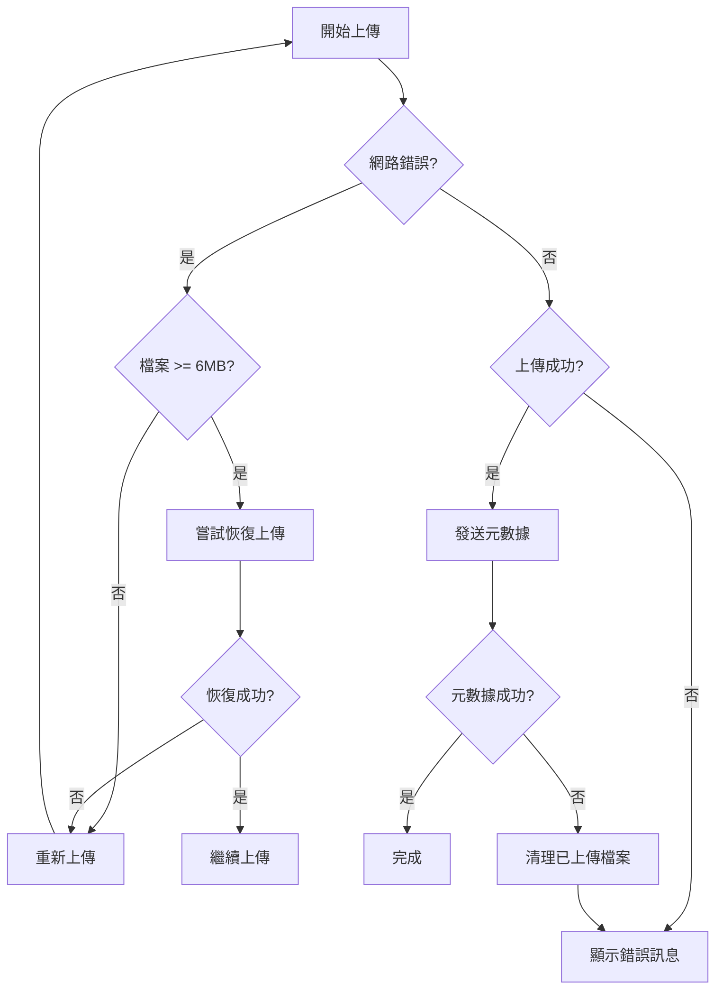

# 客戶端直接上傳架構圖

## 當前架構（有檔案大小限制）



## 新架構（無檔案大小限制）



## 詳細技術流程



## 安全性考量



## 錯誤處理流程



## 元數據 API 請求格式

```json
{
  "method": "POST",
  "endpoint": "/api/photo/upload",
  "body": {
    "fileName": "user_123456_1234567890_abc123.jpg",
    "fileUrl": "https://xxx.supabase.co/storage/v1/object/public/wedding-photos/user_123456_1234567890_abc123.jpg",
    "fileSize": 8564321,
    "fileType": "image/jpeg",
    "blessingMessage": "祝福新人百年好合",
    "isPublic": true,
    "uploaderLineId": "U1234567890"
  }
}
```

## 元數據 API 響應格式

```json
{
  "success": true,
  "message": "照片上傳成功",
  "data": {
    "id": 123,
    "user_id": "U1234567890",
    "image_url": "https://xxx.supabase.co/storage/v1/object/public/wedding-photos/user_123456_1234567890_abc123.jpg",
    "blessing_message": "祝福新人百年好合",
    "is_public": true,
    "vote_count": 0,
    "created_at": "2024-01-01T12:00:00Z"
  }
}