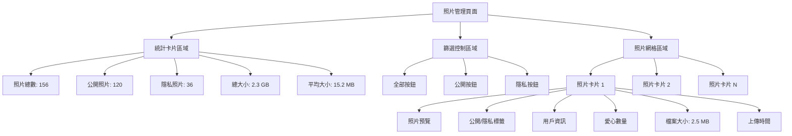
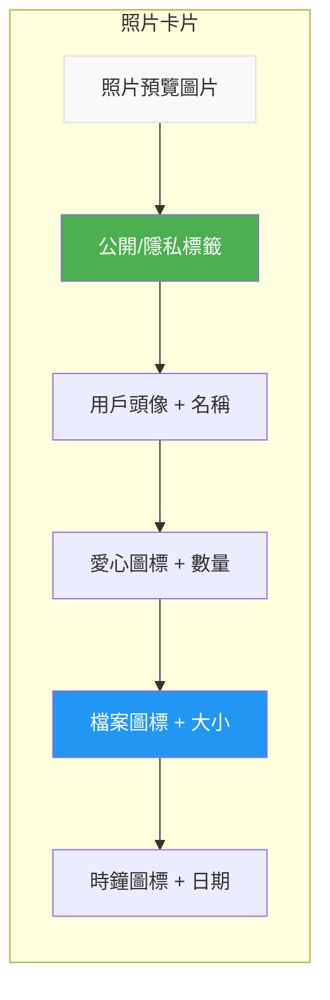
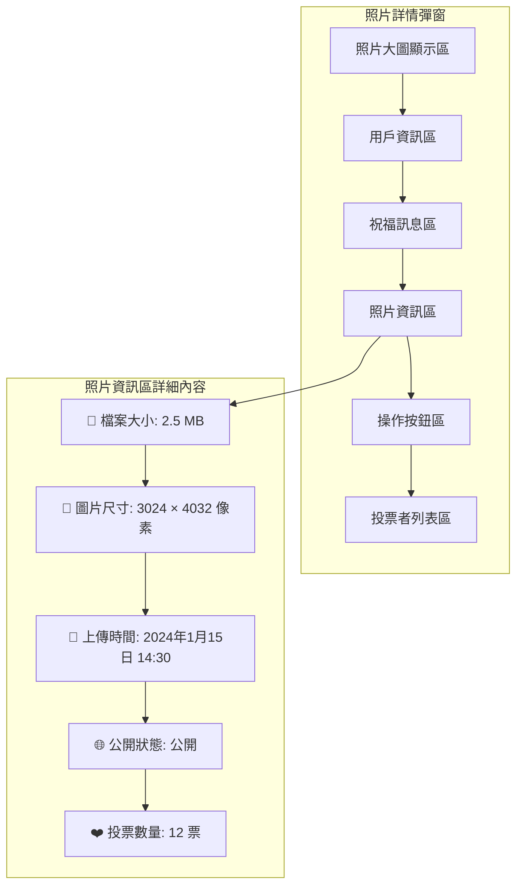
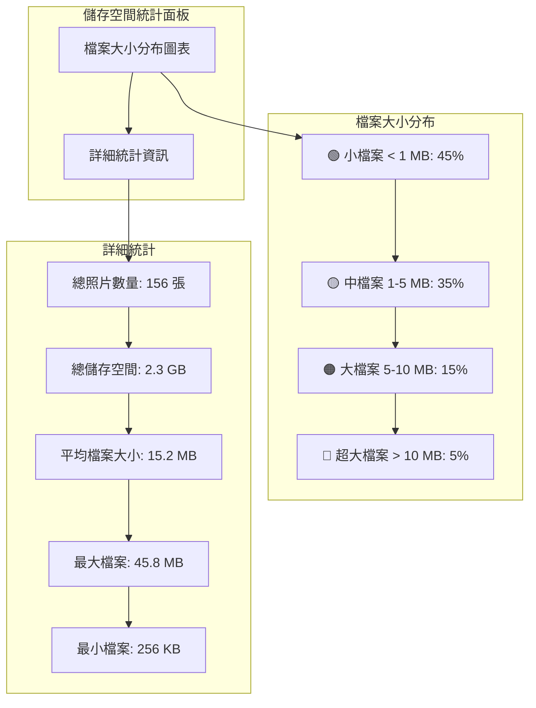
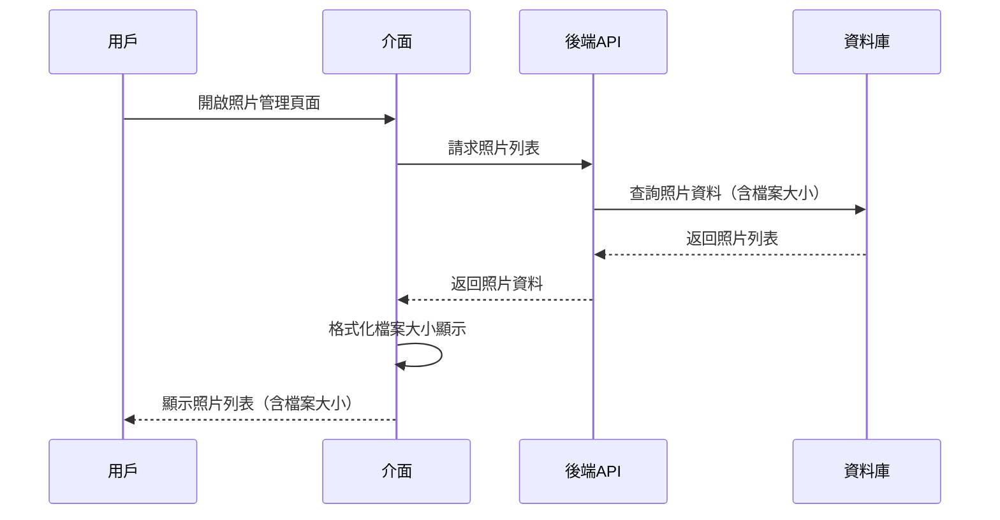
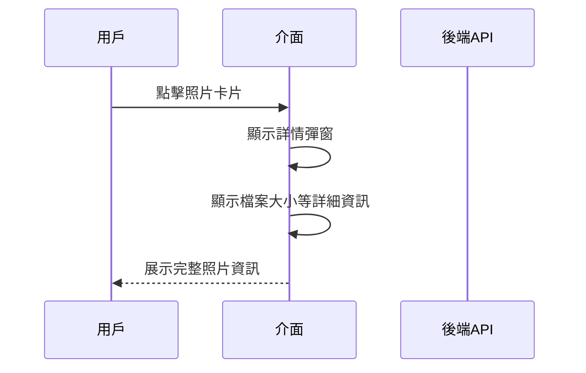

# 照片管理介面 - 檔案大小功能 UI 設計預覽

## 完整介面設計圖

### 1. 主要照片管理介面

### 2. 照片卡片詳細設計

### 3. 照片詳情彈窗設計

### 4. 統計資訊增強設計

## 介面互動流程

### 1. 檔案大小顯示流程

### 2. 照片詳情查看流程

## 視覺設計規範

### 1. 檔案大小顯示格式
- **小於 1 MB**: 顯示為 "XXX KB" (如: 800 KB)
- **1 MB - 1024 MB**: 顯示為 "X.X MB" (如: 2.5 MB)
- **大於 1024 MB**: 顯示為 "X.X GB" (如: 1.2 GB)

### 2. 顏色編碼（可選）
- **小檔案 (< 1 MB)**: 綠色 🟢
- **中檔案 (1-5 MB)**: 藍色 🔵
- **大檔案 (5-10 MB)**: 橙色 🟠
- **超大檔案 (> 10 MB)**: 紅色 🔴

### 3. 圖示使用
- **檔案大小**: 📁 或 📊
- **用戶**: 👤
- **愛心/投票**: ❤️
- **時間**: 🕒
- **公開/隱私**: 👁 / 👁‍🗨

## 響應式設計考量

### 1. 桌面版
- 照片網格: 5 列顯示
- 完整統計資訊顯示
- 詳細的檔案大小資訊

### 2. 平板版
- 照片網格: 3-4 列顯示
- 簡化統計資訊
- 保持檔案大小顯示

### 3. 手機版
- 照片網格: 2 列顯示
- 基本統計資訊
- 檔案大小以簡潔格式顯示

這個設計提供了完整的檔案大小顯示功能，同時考慮了使用者體驗和視覺層次。