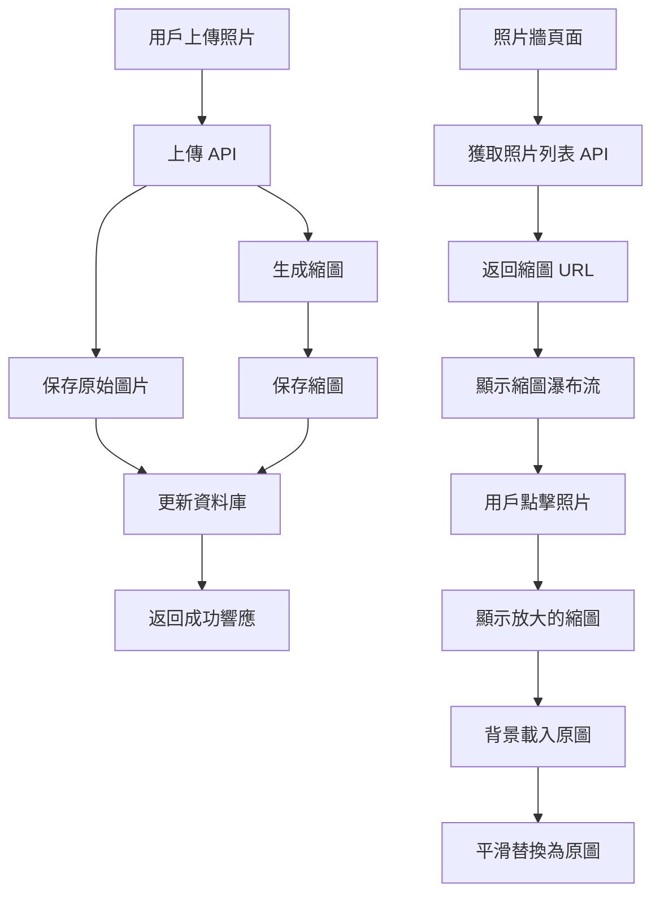

# 照片牆縮圖優化 - 技術實現設計

## 系統架構圖



## 資料庫設計

### photos 表結構更新

```sql
-- 添加縮圖相關欄位
ALTER TABLE photos ADD COLUMN IF NOT EXISTS thumbnail_url TEXT;
ALTER TABLE photos ADD COLUMN IF NOT EXISTS thumbnail_file_name TEXT;
ALTER TABLE photos ADD COLUMN IF NOT EXISTS has_thumbnail BOOLEAN DEFAULT FALSE;
ALTER TABLE photos ADD COLUMN IF NOT EXISTS thumbnail_width INTEGER;
ALTER TABLE photos ADD COLUMN IF NOT EXISTS thumbnail_height INTEGER;

-- 添加索引
CREATE INDEX IF NOT EXISTS idx_photos_has_thumbnail ON photos(has_thumbnail);
CREATE INDEX IF NOT EXISTS idx_photos_thumbnail_url ON photos(thumbnail_url) WHERE thumbnail_url IS NOT NULL;
```

### 類型定義更新

```typescript
// src/lib/supabase.ts 中的 Photo 介面更新
export interface Photo {
  id: number
  user_id: string
  image_url: string
  thumbnail_url?: string  // 新增縮圖 URL
  thumbnail_file_name?: string  // 新增縮圖文件名
  has_thumbnail?: boolean  // 新增是否有縮圖標記
  thumbnail_width?: number  // 新增縮圖寬度
  thumbnail_height?: number  // 新增縮圖高度
  blessing_message: string
  is_public: boolean
  vote_count: number
  created_at: string
  updated_at?: string
}
```

## 圖片處理模組設計

### 安裝依賴

```bash
npm install sharp
npm install --save-dev @types/sharp
```

### 圖片處理工具函數

```typescript
// src/lib/image-processing.ts
import sharp from 'sharp'
import { createSupabaseAdmin } from './supabase-server'

export interface ImageProcessingOptions {
  width?: number
  quality?: number
  format?: 'jpeg' | 'webp' | 'png'
}

export class ImageProcessor {
  private supabase = createSupabaseAdmin()
  
  /**
   * 生成縮圖
   * @param originalBuffer 原始圖片緩衝區
   * @param fileName 原始文件名
   * @param options 處理選項
   * @returns 縮圖文件名和緩衝區
   */
  async generateThumbnail(
    originalBuffer: Buffer,
    fileName: string,
    options: ImageProcessingOptions = {}
  ): Promise<{ fileName: string; buffer: Buffer; width: number; height: number }> {
    const {
      width = 150,
      quality = 85,
      format = 'jpeg'
    } = options
    
    // 處理圖片
    const result = await sharp(originalBuffer)
      .resize(width, null, { 
        withoutEnlargement: true,
        fit: 'inside'
      })
      .jpeg({ quality })
      .toBuffer({ resolveWithObject: true })
    
    // 生成縮圖文件名
    const fileExt = fileName.split('.').pop()
    const nameWithoutExt = fileName.replace(`.${fileExt}`, '')
    const thumbnailFileName = `${nameWithoutExt}_thumb.${format}`
    
    return {
      fileName: thumbnailFileName,
      buffer: result.data,
      width: result.info.width,
      height: result.info.height
    }
  }
  
  /**
   * 上傳縮圖到 Supabase Storage
   * @param thumbnailBuffer 縮圖緩衝區
   * @param thumbnailFileName 縮圖文件名
   * @returns 公開 URL
   */
  async uploadThumbnail(
    thumbnailBuffer: Buffer,
    thumbnailFileName: string
  ): Promise<string> {
    const { data, error } = await this.supabase.storage
      .from('wedding-photos')
      .upload(`thumbnails/${thumbnailFileName}`, thumbnailBuffer, {
        cacheControl: '3600',
        upsert: false
      })
    
    if (error) {
      throw new Error(`縮圖上傳失敗: ${error.message}`)
    }
    
    // 獲取公開 URL
    const { data: urlData } = this.supabase.storage
      .from('wedding-photos')
      .getPublicUrl(`thumbnails/${thumbnailFileName}`)
    
    return urlData.publicUrl
  }
}
```

## API 更新設計

### 照片上傳 API 更新

```typescript
// src/app/api/photo/upload/route.ts 關鍵更新部分
import { ImageProcessor } from '@/lib/image-processing'

export async function POST(request: NextRequest) {
  // ... 現有驗證邏輯 ...
  
  try {
    const supabase = createSupabaseAdmin()
    const formData = await request.formData()
    const file = formData.get('file') as File
    const blessingMessage = formData.get('blessingMessage') as string
    const isPublic = formData.get('isPublic') === 'true'
    const uploaderLineId = formData.get('uploaderLineId') as string
    
    // ... 現有檔案驗證邏輯 ...
    
    // 生成唯一檔案名
    const fileExt = file.name.split('.').pop()
    const fileName = `${uploaderLineId}_${Date.now()}.${fileExt}`
    
    // 將文件轉換為 Buffer
    const arrayBuffer = await file.arrayBuffer()
    const buffer = Buffer.from(arrayBuffer)
    
    // 上傳原始圖片
    const { data: uploadData, error: uploadError } = await supabase.storage
      .from('wedding-photos')
      .upload(fileName, buffer, {
        cacheControl: '3600',
        upsert: false
      })
    
    if (uploadError) {
      // ... 錯誤處理 ...
    }
    
    // 獲取原始圖片公開 URL
    const { data: urlData } = supabase.storage
      .from('wedding-photos')
      .getPublicUrl(fileName)
    
    // 生成縮圖
    const imageProcessor = new ImageProcessor()
    let thumbnailUrl: string | undefined
    let thumbnailFileName: string | undefined
    let thumbnailWidth: number | undefined
    let thumbnailHeight: number | undefined
    
    try {
      const thumbnailData = await imageProcessor.generateThumbnail(buffer, fileName)
      thumbnailUrl = await imageProcessor.uploadThumbnail(
        thumbnailData.buffer,
        thumbnailData.fileName
      )
      thumbnailFileName = thumbnailData.fileName
      thumbnailWidth = thumbnailData.width
      thumbnailHeight = thumbnailData.height
    } catch (thumbnailError) {
      console.error('縮圖生成失敗:', thumbnailError)
      // 縮圖生成失敗不影響主要上傳流程
    }
    
    // ... 確保用戶存在的邏輯 ...
    
    // 儲存照片資訊到資料庫
    const photoInsertData: any = {
      user_id: uploaderLineId,
      image_url: urlData.publicUrl,
      thumbnail_url: thumbnailUrl,
      thumbnail_file_name: thumbnailFileName,
      has_thumbnail: !!thumbnailUrl,
      thumbnail_width: thumbnailWidth,
      thumbnail_height: thumbnailHeight,
      blessing_message: blessingMessage || '',
      is_public: isPublic,
      vote_count: 0
    }
    
    // ... 插入資料庫的邏輯 ...
    
    return NextResponse.json({
      success: true,
      message: '照片上傳成功',
      data: {
        id: photoData.id,
        fileName,
        publicUrl: urlData?.publicUrl,
        thumbnailUrl,
        blessingMessage,
        isPublic,
        uploadTime: photoData.created_at || new Date().toISOString()
      }
    })
    
  } catch (error) {
    // ... 錯誤處理 ...
  }
}
```

### 照片列表 API 更新

```typescript
// src/app/api/photo/list/route.ts 關鍵更新部分
export async function GET(request: NextRequest) {
  try {
    const supabase = createSupabaseAdmin()
    const { searchParams } = new URL(request.url)
    
    const sortBy = searchParams.get('sortBy') || 'votes'
    const isPublic = searchParams.get('isPublic') === 'true'
    const limit = searchParams.get('limit') ? parseInt(searchParams.get('limit')!) : undefined
    
    // 構建查詢，包含縮圖欄位
    let query = supabase
      .from('photos')
      .select(`
        *,
        uploader:users!photos_user_id_fkey(display_name, avatar_url)
      `)
    
    // ... 其餘查詢邏輯保持不變 ...
    
    const { data: photos, error } = await query
    
    if (error) {
      // ... 錯誤處理 ...
    }
    
    // 確保每個照片對象都有完整的縮圖信息
    const processedPhotos = (photos || []).map(photo => ({
      ...photo,
      thumbnail_url: photo.thumbnail_url || photo.image_url, // 向後相容
      has_thumbnail: photo.has_thumbnail || false
    }))
    
    return NextResponse.json({
      success: true,
      data: {
        photos: processedPhotos,
        total: processedPhotos.length,
        sortBy,
        isPublic
      }
    })
    
  } catch (error) {
    // ... 錯誤處理 ...
  }
}
```

## 前端組件更新設計

### 照片牆組件更新

```typescript
// src/app/photo-wall/page.tsx 關鍵更新部分

// 在照片渲染部分使用縮圖
<div className="columns-3 sm:columns-4 md:columns-5 lg:columns-4 xl:columns-5 gap-3 sm:gap-4 space-y-3 sm:space-y-4">
  {displayedPhotos.map((photo) => (
    <div 
      key={photo.id} 
      className="break-inside-avoid mb-3 sm:mb-4 cursor-pointer group"
      onClick={() => setSelectedPhoto(photo)}
    >
      <div className="bg-white rounded-xl sm:rounded-2xl shadow-lg overflow-hidden hover:shadow-2xl transition-all duration-300 hover:scale-[1.02]">
        {/* 照片 - 使用縮圖 */}
        <div className="relative">
          
          
          {/* 票數顯示 */}
          <div className="absolute bottom-2 left-2 sm:bottom-3 sm:left-3 bg-black/70 text-white px-2 py-1 sm:px-3 sm:py-1.5 rounded-full flex items-center space-x-1">
            <Heart className="w-3 h-3 sm:w-4 sm:h-4 fill-current" />
            <span className="text-xs sm:text-sm font-semibold">{photo.vote_count}</span>
          </div>
        </div>
        
        {/* 簡化資訊 */}
        <div className="p-2 sm:p-3">
          <div className="flex items-center space-x-1.5 sm:space-x-2">
            
            <span className="text-xs sm:text-sm font-medium text-gray-800 truncate">
              {photo.uploader.display_name}
            </span>
          </div>
        </div>
      </div>
    </div>
  ))}
</div>
```

### 漸進式載入照片模態框

```typescript
// src/components/PhotoModal.tsx - 新組件
'use client'

import { useState, useEffect } from 'react'
import { PhotoWithUser } from '@/lib/supabase'
import { X, Heart } from 'lucide-react'

interface PhotoModalProps {
  photo: PhotoWithUser
  onClose: () => void
  onVote: (photoId: number) => void
  userVotes: Record<number, number>
  votingEnabled: boolean
  votingInProgress: Set<number>
}

export default function PhotoModal({ 
  photo, 
  onClose, 
  onVote, 
  userVotes, 
  votingEnabled, 
  votingInProgress 
}: PhotoModalProps) {
  const [imageLoaded, setImageLoaded] = useState(false)
  const [imageError, setImageError] = useState(false)
  
  // 重置狀態當照片變更時
  useEffect(() => {
    setImageLoaded(false)
    setImageError(false)
  }, [photo.id])
  
  const handleImageLoad = () => {
    setImageLoaded(true)
  }
  
  const handleImageError = () => {
    setImageError(true)
  }
  
  return (
    <div 
      className="fixed inset-0 bg-black/95 z-50 flex items-center justify-center p-4 animate-fadeIn"
      onClick={onClose}
    >
      <div className="max-w-6xl w-full h-full flex flex-col">
        {/* 頂部工具列 */}
        <div className="flex items-center justify-between p-4 text-white flex-shrink-0">
          <div className="flex items-center space-x-4">
            
            <div>
              <h3 className="font-semibold text-lg">{photo.uploader.display_name}</h3>
              <p className="text-sm text-gray-300">
                {new Date(photo.created_at).toLocaleString('zh-TW')}
              </p>
            </div>
          </div>
          
          <button
            onClick={onClose}
            className="p-2 hover:bg-white/10 rounded-full transition-colors"
          >
            <X className="w-6 h-6" />
          </button>
        </div>
        
        {/* 可滾動的內容區域 */}
        <div 
          className="flex-1 overflow-y-auto overflow-x-hidden px-4 pb-4"
          onClick={(e) => e.stopPropagation()}
        >
          {/* 照片容器 */}
          <div className="flex items-center justify-center relative min-h-0 mb-4">
            {/* 縮圖（初始顯示） */}
            
            
            {/* 原圖（背景載入） */}
             e.stopPropagation()}
            />
            
            {/* 載入指示器 */}
            {!imageLoaded && !imageError && (
              <div className="absolute inset-0 flex items-center justify-center">
                <div className="animate-spin rounded-full h-12 w-12 border-b-2 border-white"></div>
              </div>
            )}
            
            {/* 錯誤指示器 */}
            {imageError && (
              <div className="absolute inset-0 flex items-center justify-center">
                <div className="text-white text-center">
                  <p className="text-lg">載入失敗</p>
                  <p className="text-sm mt-2">請稍後再試</p>
                </div>
              </div>
            )}
            
            {/* 投票區域 - 右上角 */}
            {votingEnabled && (
              <div className="absolute top-4 right-4 flex items-center space-x-3">
                {/* 得票數顯示 */}
                <div className="bg-pink-500/90 backdrop-blur-sm px-4 py-2 rounded-full flex items-center space-x-2 shadow-lg">
                  <Heart className="w-5 h-5 fill-current text-white" />
                  <span className="font-semibold text-white">{photo.vote_count}</span>
                </div>
                
                {/* 投票按鈕 */}
                <button
                  onClick={(e) => {
                    e.stopPropagation()
                    onVote(photo.id)
                  }}
                  disabled={votingInProgress.has(photo.id)}
                  className={`p-3 rounded-full shadow-2xl transition-all duration-200 backdrop-blur-sm ${
                    votingInProgress.has(photo.id)
                      ? 'bg-white/60 cursor-wait'
                      : userVotes[photo.id] > 0
                      ? 'bg-white/90'
                      : 'bg-white/90 hover:bg-white hover:scale-110'
                  }`}
                >
                  <Heart className={`w-8 h-8 transition-all ${
                    votingInProgress.has(photo.id)
                      ? 'text-gray-400 animate-pulse'
                      : userVotes[photo.id] > 0 
                      ? 'text-red-500 fill-current drop-shadow-lg' 
                      : 'text-gray-400 hover:text-pink-500'
                  }`} />
                </button>
              </div>
            )}
          </div>
          
          {/* 祝福訊息區域 */}
          {photo.blessing_message && (
            <div 
              className="bg-white/10 backdrop-blur-md rounded-2xl p-6 text-white"
              onClick={(e) => e.stopPropagation()}
            >
              <p className="text-white/90 leading-relaxed text-lg break-words">
                {photo.blessing_message}
              </p>
            </div>
          )}
        </div>
      </div>
    </div>
  )
}
```

## 舊照片遷移腳本設計

```sql
-- database/migrate-photos-to-thumbnails.sql
-- 為現有照片生成縮圖的遷移腳本

-- 1. 標記所有沒有縮圖的照片
CREATE TEMPORARY TABLE photos_without_thumbnails AS
SELECT id, image_url, user_id, created_at
FROM photos
WHERE has_thumbnail = FALSE OR has_thumbnail IS NULL;

-- 2. 創建遷移記錄表
CREATE TABLE IF NOT EXISTS photo_thumbnail_migration (
  id SERIAL PRIMARY KEY,
  photo_id INTEGER REFERENCES photos(id),
  status VARCHAR(20) DEFAULT 'pending', -- pending, processing, completed, failed
  error_message TEXT,
  created_at TIMESTAMP WITH TIME ZONE DEFAULT NOW(),
  updated_at TIMESTAMP WITH TIME ZONE DEFAULT NOW()
);

-- 3. 插入需要遷移的照片記錄
INSERT INTO photo_thumbnail_migration (photo_id)
SELECT id FROM photos_without_thumbnails
ON CONFLICT DO NOTHING;

-- 4. 創建遷移狀態查詢函數
CREATE OR REPLACE FUNCTION get_migration_status()
RETURNS TABLE(
  total_photos BIGINT,
  pending_migration BIGINT,
  processing_migration BIGINT,
  completed_migration BIGINT,
  failed_migration BIGINT
) AS $$
BEGIN
  RETURN QUERY
  SELECT 
    COUNT(*)::BIGINT as total_photos,
    COUNT(*) FILTER (WHERE status = 'pending')::BIGINT as pending_migration,
    COUNT(*) FILTER (WHERE status = 'processing')::BIGINT as processing_migration,
    COUNT(*) FILTER (WHERE status = 'completed')::BIGINT as completed_migration,
    COUNT(*) FILTER (WHERE status = 'failed')::BIGINT as failed_migration
  FROM photo_thumbnail_migration;
END;
$$ LANGUAGE plpgsql;

-- 5. 創建獲取下一批待處理照片的函數
CREATE OR REPLACE FUNCTION get_next_migration_batch(batch_size INTEGER DEFAULT 10)
RETURNS TABLE(
  photo_id INTEGER,
  image_url TEXT,
  user_id TEXT,
  migration_id INTEGER
) AS $$
BEGIN
  -- 更新一批記錄為處理中狀態
  UPDATE photo_thumbnail_migration
  SET status = 'processing', updated_at = NOW()
  WHERE id IN (
    SELECT id FROM photo_thumbnail_migration
    WHERE status = 'pending'
    ORDER BY created_at
    LIMIT batch_size
  )
  RETURNING photo_id;
  
  -- 返回這批照片的信息
  RETURN QUERY
  SELECT 
    p.id as photo_id,
    p.image_url,
    p.user_id,
    m.id as migration_id
  FROM photos p
  JOIN photo_thumbnail_migration m ON p.id = m.photo_id
  WHERE m.status = 'processing'
  ORDER BY m.updated_at;
END;
$$ LANGUAGE plpgsql;

-- 6. 創建更新遷移狀態的函數
CREATE OR REPLACE FUNCTION update_migration_status(
  migration_id INTEGER,
  new_status VARCHAR(20),
  thumbnail_url TEXT DEFAULT NULL,
  error_message TEXT DEFAULT NULL
)
RETURNS BOOLEAN AS $$
BEGIN
  -- 更新遷移狀態
  UPDATE photo_thumbnail_migration
  SET 
    status = new_status,
    updated_at = NOW(),
    error_message = CASE 
      WHEN new_status = 'failed' THEN error_message
      ELSE NULL
    END
  WHERE id = migration_id;
  
  -- 如果成功，更新照片記錄
  IF new_status = 'completed' AND thumbnail_url IS NOT NULL THEN
    UPDATE photos
    SET 
      thumbnail_url = thumbnail_url,
      has_thumbnail = TRUE,
      updated_at = NOW()
    WHERE id = (SELECT photo_id FROM photo_thumbnail_migration WHERE id = migration_id);
  END IF;
  
  RETURN TRUE;
END;
$$ LANGUAGE plpgsql;

-- 7. 創建清理遷移記錄的函數（成功遷移30天後清理）
CREATE OR REPLACE FUNCTION cleanup_migration_records()
RETURNS INTEGER AS $$
DECLARE
  deleted_count INTEGER;
BEGIN
  DELETE FROM photo_thumbnail_migration
  WHERE status = 'completed' 
  AND updated_at < NOW() - INTERVAL '30 days';
  
  GET DIAGNOSTICS deleted_count = ROW_COUNT;
  RETURN deleted_count;
END;
$$ LANGUAGE plpgsql;

-- 初始查詢遷移狀態
SELECT * FROM get_migration_status();
```

## 部署和監控計畫

### 部署步驟

1. **準備階段**
   - 備份當前資料庫
   - 準備回滾計畫

2. **資料庫更新**
   - 執行 `database/add-thumbnail-support.sql`
   - 驗證表結構更新

3. **後端部署**
   - 部署更新的 API 端點
   - 測試新上傳照片的縮圖生成

4. **遷移腳本部署**
   - 部署遷移腳本
   - 可選：立即執行或後台執行

5. **前端部署**
   - 部署更新的前端組件
   - 驗證照片牆顯示

### 監控指標

- **性能指標**
  - 照片牆初始載入時間
  - 縮圖載入成功率
  - 原圖載入成功率

- **遷移指標**
  - 待遷移照片數量
  - 遷移成功率
  - 遷移錯誤率

- **用戶體驗指標**
  - 照片點擊率
  - 模態框載入時間
  - 用戶停留時間

### 回滾計畫

如果出現問題，可以按以下順序回滾：

1. 前端回滾到使用原始圖片
2. 後端回滾到不生成縮圖
3. 保留資料庫結構（不影響功能）

## 總結

這個技術實現設計提供了一個完整的解決方案，包括：

1. **資料庫結構更新** - 添加縮圖相關欄位
2. **圖片處理模組** - 使用 Sharp 生成縮圖
3. **API 更新** - 支援縮圖生成和返回
4. **前端組件更新** - 實現漸進式載入
5. **遷移腳本** - 處理舊照片
6. **部署和監控** - 確保順利上線

這個設計保持了現有架構不變，同時顯著提高了照片牆的載入性能。