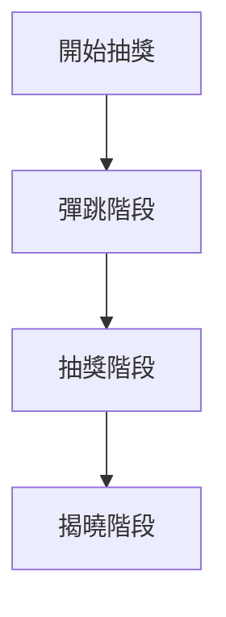

# Lottery Machine 動畫模式重新設計

## 概述
重新設計 Lottery Machine 動畫模式，模擬真實彩票機的效果，照片從腔體底部管道跑出來。

## 動畫流程



### 階段說明

1. **彈跳階段**（3秒）
   - 所有照片在圓形腔體內隨機彈跳
   - 碰到邊界會反彈
   - 隨機旋轉和隨機速度

2. **抽獎階段**（每 1.5 秒一位）
   - 照片依序移動到管道入口
   - 照片進入管道
   - 照片在管道中旋轉
   - 照片從管道底部跑出來
   - 到達中獎者顯示區

3. **揭曉階段**（1秒後）
   - 顯示所有中獎者照片和資訊

## 視覺設計

### 腔體設計
- **形狀**：圓形，半徑 350px
- **玻璃效果**：半透明，可以看到照片在裡面
- **光澤**：漸變效果，增加立體感
- **邊界**：白色邊框，8px 寬度

### 管道設計
- **位置**：腔體底部中央
- **尺寸**：寬 120px，高 200px
- **背景**：半透明玻璃效果
- **光澤**：漸變效果
- **閘門**：底部有可開閘的門
- **動畫**：抽獎時閘門打開

### 照片效果
- **正常彈跳**：
  - 隨機位置和旋轉
  - 透明度：1
  - 陰影：圓形陰影
  
- **管道內照片**：
  - 旋轉動畫：`animate-spin`，模擬被攪拌
  - 透明度：0.8
  - 位置：固定在管道內

- **照片軌跡**：
  - 拖尾效果：半透明圓形
  - 動畫：隨機上下移動
  - 透明度：0.3

### 機械效果
- **閘門**：
  - 平時：關閉（灰色）
  - 抽獎時：打開（綠色）
  - 動畫：`translateY(0)` → `translateY(100%)`，持續 300ms

### 中獎者顯示
- **位置**：底部中央，水平排列
- **間距**：300px
- **發光效果**：黃色光澤 + 脈動
- **照片尺寸**：192px × 192px
- **排名標籤**：黃色圓形，顯示順序
- **名稱**：白色文字
- **順序標籤**：黃色數字

## 技術實現要點

### 1. 照片狀態管理
- 使用 `BouncingPhoto` 接口
- 追蹤：`x`, `y`, `vx`, `vy`, `angle`, `vAngle`, `scale`, `opacity`
- 管道狀態：`pipePhase` ('entering' | 'exiting' | 'complete')

### 2. 物理引擎
- **彈跳物理**：
  - 檢查腔體邊界碰撞
  - 反彈向量計算
  - 添加隨機性到速度
  
- **管道動畫**：
  - 移動到管道入口：計算距離，移動到入口
  - 進入管道：固定位置，設置 `pipePhase: 'entering'`
  - 在管道中旋轉：持續旋轉
  - 跑出管道：向下移動，設置 `pipePhase: 'exiting'`
  - 到達目標：停止移動，設置 `pipePhase: 'complete'`

### 3. 動畫循環
- 使用 `requestAnimationFrame` 實現流暢動畫
- 使用 `useRef` 追蹤 `rafRef` 和 `photoIdRef`
- 使用 `useCallback` 優存物理更新函數

### 4. 效能優化
- **避免不必要的重渲染**：使用 `memo` 包裝照片組件
- **使用 ref**：避免閉包問題
- **條件渲染**：只在管道內渲染照片時使用特殊樣式

### 5. 視覺細節
- **管道透明度**：0.7，可以看到照片在裡面
- **管道光澤**：漸變效果，模擬玻璃反光
- **閘門動畫**：平滑開啟，持續 300ms
- **照片軌跡**：添加上下移動動畫，模擬被攪拌的效果

## 參數配置
- `CHAMBER_RADIUS`：350px
- `CHAMBER_CENTER_X`：960px (DESIGN_WIDTH / 2)
- `CHAMBER_CENTER_Y`：440px (DESIGN_HEIGHT / 2 - 100)
- `PHOTO_SIZE`：80px
- `PIPE_WIDTH`：120px
- `PIPE_HEIGHT`：200px
- `BOUNCE_SPEED`：可調整（0.5x - 3x）

## 檔案結構
```
src/components/lottery-modes/
├── types.ts              # 類型定義
├── index.ts             # 導出所有組件
├── FastShuffleLottery.tsx
├── WaterfallLottery.tsx
├── TournamentLottery.tsx
└── LotteryMachineLottery.tsx  # 新增組件
```

## 實現步驟
1. 修復 `lottery-machine-sim/page.tsx` 的語法錯誤
2. 創建新的 `LotteryMachineLottery.tsx` 組件
3. 更新 `src/components/lottery-modes/index.ts` 導出新組件
4. 更新 `src/app/admin/lottery/page.tsx` 新增選項
5. 更新 `src/app/lottery-live/page.tsx` 整合新組件
